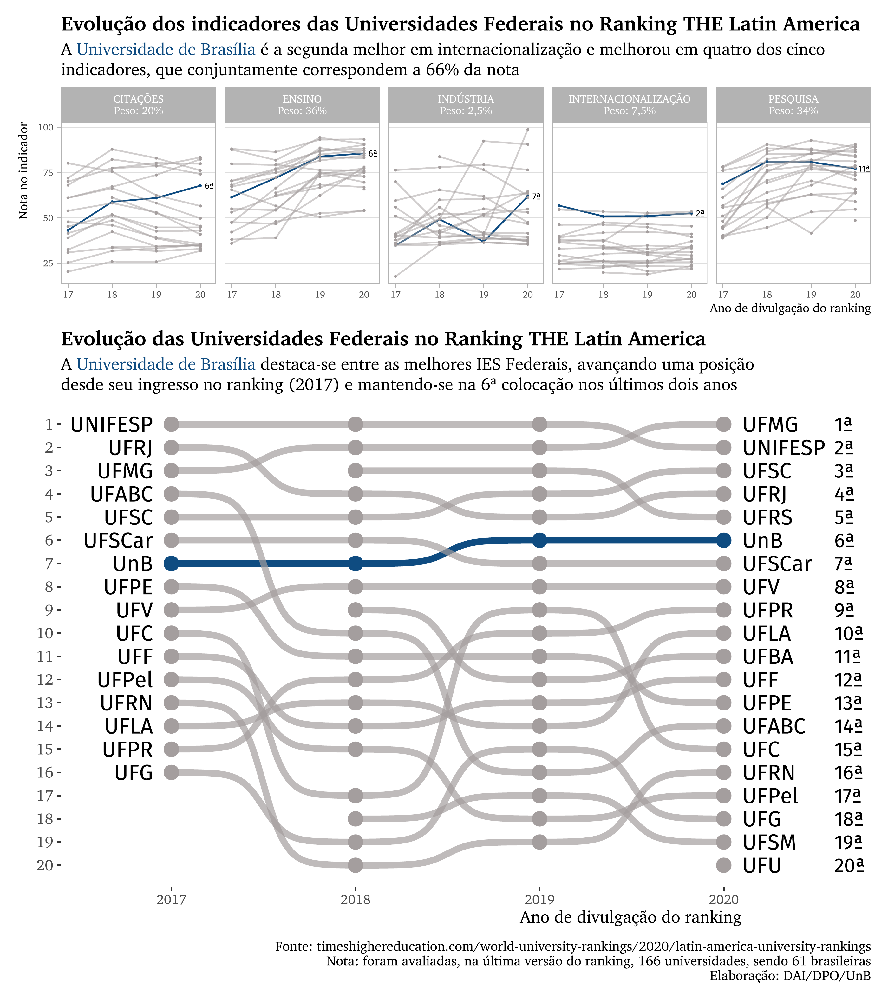
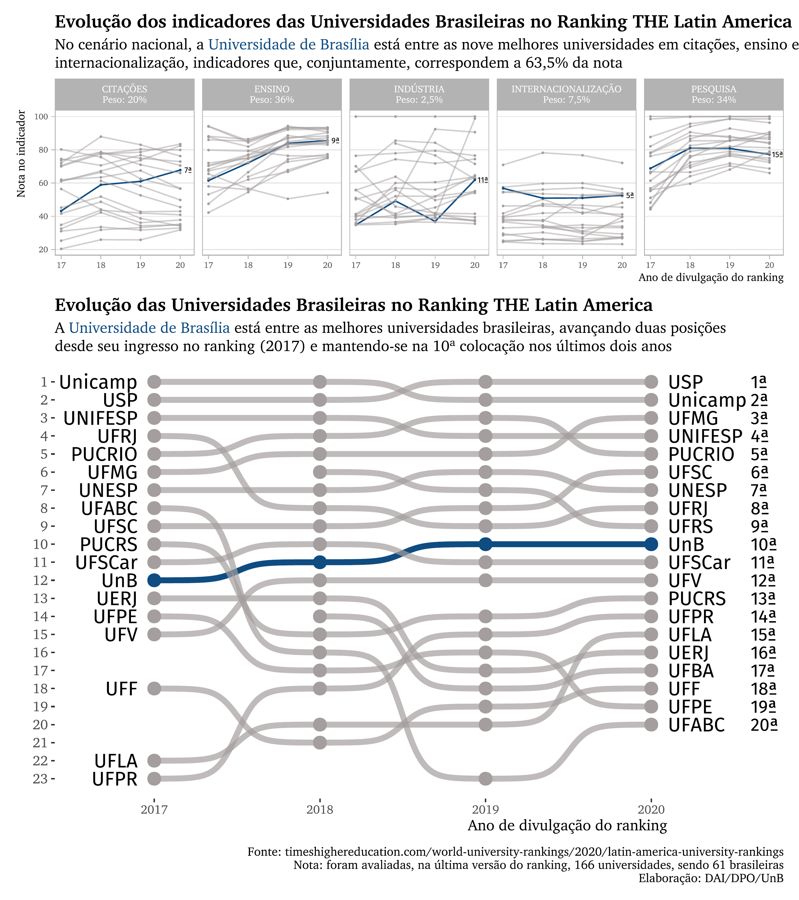

# THE LATIN AMERICA Rankings

## Data analysis of the Times Higher Education Latin America ranking in Brazil

In this project, I used the data available at https://www.timeshighereducation.com/world-university-rankings/2020/latin-america-university-ranking, considering the ranking versions that University of Brasília took part: 2017, 2018, 2019 and 2020. The data was extracted and saved to an Excel file manually, but all the processing was done in R (01_gera_dados.R).

During the EDA (Exploratory Data Analysis) phase, I've encountered an error in the data: the calculated overall score was different from the displayed overall score. I reported this finding to the THE staff, and they confirmed that two indicators, research and teaching, were incorrectly displayed in the site, and were promplty corrected, without any changes to the other indicators or positions.

The resulting plot is composed of two narratives that complement each other. The first part explores how all universities fared in each of the indicators that the ranking measures, displaying its respective weight - citations, teaching, industry income, international outlook and research. Because the focus is UnB, its position in every indicator is displayed at the end of the evolution.

The second narrative of the plot shows the evolution of the universities' position, highlighting, once again, UnB, in blue.

Two plots were made. One to analyze how UnB fares country-wise (03_grafico_nacional.R) and another to compare UnB to its federal peers (02_grafico_federais.R), which is the more realistic scenario. Nonetheless, in both cases, UnB is doing very well regarding its indicators (all but research improved from the last version to this one) and its overall position.

Below are the two plots discussed.

 

